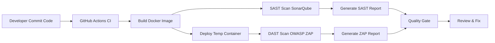

# DevSecOps Week 5

## Continuous Integration with SAST & DAST Pipeline


---

## 1. Overview

Repository ini berisi implementasi pipeline DevSecOps yang mengintegrasikan SAST (Static Application Security Testing) menggunakan SonarQube dan DAST (Dynamic Application Security Testing) menggunakan OWASP ZAP. Pipeline dirancang untuk melakukan build, scanning otomatis, dan menghasilkan laporan keamanan setiap kali terjadi perubahan kode.

---

## 2. Arsitektur DevSecOps Pipeline



Diagram di atas menggambarkan alur otomatis pada pipeline CI: setiap commit memicu proses build, analisis kode, pengujian aplikasi secara dinamis, hingga pembuatan laporan keamanan.

---

## 3. Materi DevSecOps yang Diimplementasikan

### 3.1 Static Application Security Testing (SAST)

SAST memeriksa kode sumber sebelum dijalankan. Tools yang digunakan:

* SonarQube Scanner
* SonarQube Quality Gate

Manfaat:

* Deteksi dini SQL Injection, XSS, Hardcoded Credentials, Code Smell
* Identifikasi potential bug dan security hotspot

### 3.2 Dynamic Application Security Testing (DAST)

DAST memeriksa aplikasi yang sedang berjalan menggunakan OWASP ZAP:

* Baseline scan terhadap endpoint utama aplikasi
* Deteksi XSS, CSP missing, CORS misconfig, Cookie flags weakness, Server header leaks

### 3.3 CI/CD Integration

Pipeline dibangun menggunakan GitHub Actions dengan kemampuan:

* Build image otomatis
* Security scanning otomatis
* Upload laporan
* Quality gate evaluation

---

## 4. Step-by-Step Build dan Scan

### 4.1 Build Docker Image

```
docker build -t antrian-app .
```

### 4.2 Run Application Container

```
docker run -d --name antrian -p 8080:80 antrian-app
```

### 4.3 SonarQube SAST Scan

```
sonar-scanner \
  -Dsonar.projectKey=antrian-app \
  -Dsonar.sources=. \
  -Dsonar.host.url=http://localhost:9000 \
  -Dsonar.login=YOUR_TOKEN
```

### 4.4 OWASP ZAP DAST Scan

```
docker run --rm -u root --network host \
  -v $(pwd):/zap/wrk:rw \
  ghcr.io/zaproxy/zaproxy:stable \
  zap-baseline.py -t "http://localhost:8080" -r zap_report.html
```

---

## 5. Contoh CVE dan Mitigasi

### 5.1 CSP Header Missing

**CVE Category:** XSS
**Dampak:** Browser tidak memiliki kontrol terhadap sumber script.
**Mitigasi:**

```
Header always set Content-Security-Policy "default-src 'self'; script-src 'self';"
```

### 5.2 Server Version Disclosure

**CVE Category:** Information Exposure
**Dampak:** Penyerang dapat mengetahui versi Apache.
**Mitigasi:**

```
ServerSignature Off
ServerTokens Prod
Header unset Server
```

### 5.3 Cookie Flags Missing

**CVE Category:** Session Hijacking
**Mitigasi (PHP):**

```php
ini_set('session.cookie_httponly', 1);
ini_set('session.cookie_secure', 1);
ini_set('session.cookie_samesite', 'Lax');
```

### 5.4 Missing Cache Control on Sensitive Pages

**Mitigasi:**

```php
header('Cache-Control: no-store, no-cache, must-revalidate');
```

---

## 6. Integrasi GitHub Actions

### File: `.github/workflows/ci-security.yml`

Pipeline ini mencakup:

* Setup Java
* SonarQube Scanner
* Quality Gate
* Docker Build & Run
* OWASP ZAP Baseline Scan
* Upload report

Semua temuan High tidak menghentikan proses (non-blocking) untuk kebutuhan testing.

---

## 7. Struktur Repository

```
.
├── auth/
│   ├── db.php
│   └── csrf-security/
├── ajax/
│   ├── updateNoAntrian.php
├── assets/
├── Dockerfile
├── sonar-project.properties
├── README.md
└── .github/
    └── workflows/
        └── ci-security.yml
```

---

## 8. Quality Gate

Quality Gate digunakan sebagai penentu apakah kode layak dirilis berdasarkan:

* Bugs
* Vulnerabilities
* Code Smells
* Coverage
* Security Hotspots

Untuk lingkungan testing, quality gate dibuat non-blocking agar pipeline tetap berjalan.

---

## 9. Security Headers Rekomendasi

Tambahkan pada Apache:

```
Header always set X-Content-Type-Options "nosniff"
Header always set X-Frame-Options "SAMEORIGIN"
Header always set Referrer-Policy "no-referrer"
Header always set Cross-Origin-Resource-Policy "same-origin"
Header always set Cross-Origin-Embedder-Policy "require-corp"
```

---

## 10. Kesimpulan

Repository ini menunjukkan implementasi pipeline DevSecOps modern menggunakan:

* GitHub Actions
* SonarQube untuk SAST
* OWASP ZAP untuk DAST
* Docker containerization
* Security headers hardening

Pipeline ini dapat dijadikan dasar untuk pengembangan aplikasi yang aman dan siap di-deploy.
